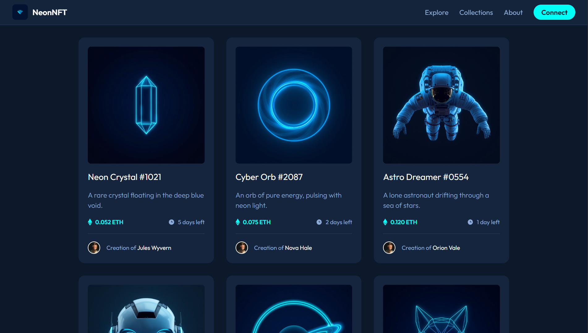
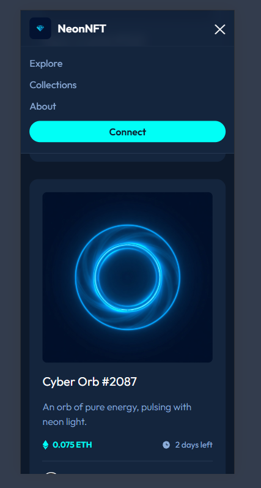
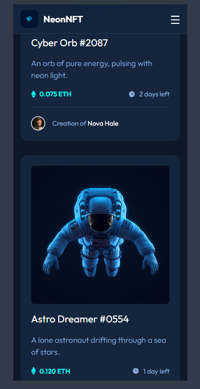

# NeonNFT 💎

Vitrine de NFTs com tema neon, desenvolvida em grupo como parte do **Desafio Portfólio 1.0**. O projeto evoluiu em três fases: um card de NFT, uma lista de cards com animações e, por fim, um header com logo e menu responsivo.

## 🔗 Links

- **Site no ar (GitHub Pages):** https://jean-2009.github.io/nft-portifolio/
- **Repositório:** https://github.com/Jean-2009/nft-portifolio
- **Desafio original (Frontend Mentor):** https://www.frontendmentor.io/challenges/nft-preview-card-component-SbdUL_w0U

## 📸 Screenshots

### Desktop


### Mobile


### Menu mobile aberto


## ✨ Funcionalidades

- Card de NFT fiel ao design proposto pelo Frontend Mentor
- Lista com 6 cards, cada um com imagem, preço, tempo restante e autor diferentes
- Efeito de hover nos cards (elevação e brilho) e na imagem (overlay ciano com ícone)
- Animações de entrada escalonadas com Animate.css
- Header fixo no topo com logo, navegação e botão de destaque
- Menu hambúrguer no mobile
- Layout responsivo (mobile e desktop)

## 🛠️ Tecnologias

| Tecnologia | Uso |
|---|---|
| HTML5 | Estrutura semântica da página |
| CSS3 | Grid, Flexbox, variáveis CSS e media queries |
| JavaScript | Abrir e fechar o menu mobile |
| [Animate.css](https://animate.style/) | Animações de entrada dos cards |
| [Google Fonts (Outfit)](https://fonts.google.com/specimen/Outfit) | Tipografia |
| [Leonardo.ai](https://app.leonardo.ai/) | Geração das imagens dos NFTs e da logo |
| Git e GitHub | Controle de versão e trabalho em equipe |
| GitHub Pages | Hospedagem |

## 💡 Inspiração

O design do header e dos cards foi inspirado em marketplaces de NFT, como:

- [OpenSea](https://opensea.io/): header com logo à esquerda e menu à direita
- [Rarible](https://rarible.com/): fundo escuro e cards em destaque
- NOME-DO-SITE-3 (se tiverem usado outro, coloquem aqui)

## 🌿 Fluxo de trabalho com Git

O projeto foi feito em fases, cada uma em uma branch separada e integrada à `main` por Pull Request:

| Fase | Branch | Descrição |
|---|---|---|
| 1.0 | `feature/nft-card` | Componente CardNFT com hover |
| 1.1 | `feature/card-list` | Lista de cards com imagens do Leonardo.ai e animações |
| 1.2 | `feature/header` | Header com logo e menu responsivo |

Todos os commits foram escritos em inglês.

## 📁 Estrutura do projeto

```
├── index.html
├── css/
│   └── style.css
├── images/
│ 
├── screenshots/
└── README.md
```

## 🚀 Como rodar localmente

```bash
git clone https://github.com/SEU-USUÁRIO/nft-portifolio.git
cd nft-portifolio
```

Depois, abra o `index.html` no navegador (ou use a extensão Live Server do VS Code).

## 👥 Autores

- Aluno 1 - [@Jean-2009](https://github.com/Jean-2009)
- Aluno 2 - [@Sergio-Horta](https://github.com/Sergio-Horta)

## 📚 Créditos

- Desafio e design original: [Frontend Mentor](https://www.frontendmentor.io/challenges/nft-preview-card-component-SbdUL_w0U)
- Imagens e logo: geradas com [Leonardo.ai](https://app.leonardo.ai/)
- Animações: [Animate.css](https://animate.style/)